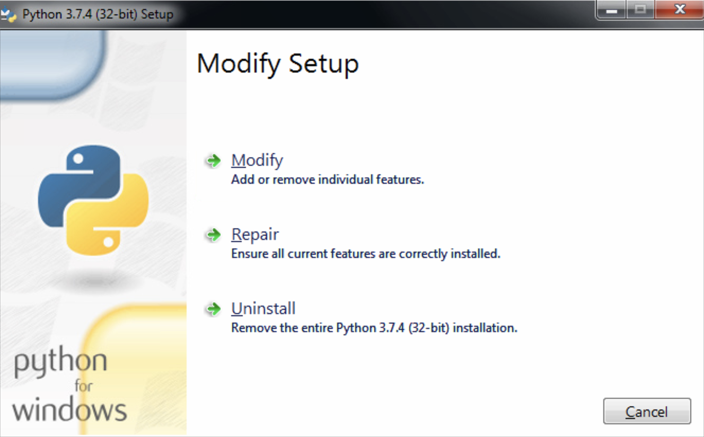
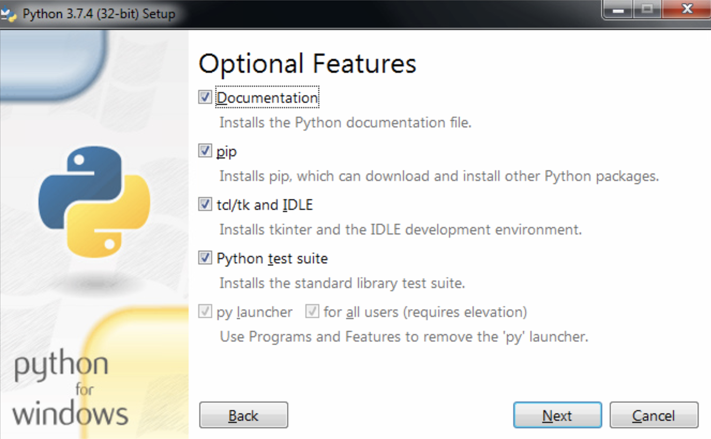
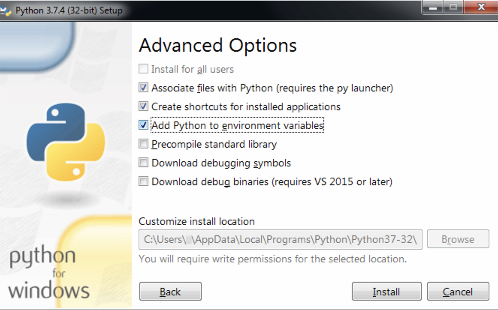
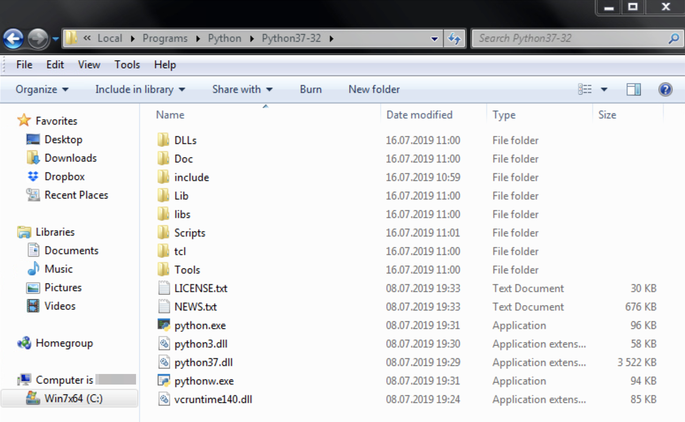

BigData 2019 Course Package. Case 01
====================================

Installation
------------

In order to run scripts in the repository, please install software below.

1. Install [Python 3.7.4](https://www.python.org/downloads/) or later.

    To make sure the installation was successful, open your Terminal or Windows PowerShell
    and check python availability and version:
    
        > python --version
        Python 3.7.4
    
    If the version does not match the version you just installed, try `python3`:
    
        > python3 --version
        Python 3.7.4
       
    If still no command available or the version is incorrect, try
    one of the troubleshooting guides below:
    
    * [Add Python to Windows PATH with Python Installer](#add-python-to-windows-path-with-python-installer)
    * [Add Python to Windows PATH with Windows PowerShell](#add-python-to-windows-path-with-windows-powershell)

1. If your Python 3.7 is available as `python3`, use it instead of `python`
    in all steps below.

1. Install [Fabric](http://www.fabfile.org) package:

        > python -m pip install fabric

    Check the installation:
    
        > fab --version
        Fabric 2.4.0
        Paramiko 2.4.1
        Invoke 1.2.0
    
1. Install free [Docker Desktop Community Edition](https://hub.docker.com/search/?type=edition&offering=community).

    Check that Docker is installed:
    
        > docker --version
        Docker version 18.09.2, build 6247962
        
    Check that Docker is able  to create containers:
    
        > docker run busybox echo "Hello!"
        Hello!
        
    If something goes wrong and you are unable to run commands above,
    please carefully follow the installation instructions for your system
    (you may even need to change BIOS settings):
    
    * [Install Docker Desktop for Mac](https://docs.docker.com/docker-for-mac/install/)
    * [Install Docker Desktop for Windows](https://docs.docker.com/docker-for-windows/install/)

1. Windows only: Install the latest [Microsoft Visual C++ Redistributable](https://support.microsoft.com/en-us/help/2977003/the-latest-supported-visual-c-downloads).

Troubleshooting
---------------

### Add Python to Windows PATH with Python Installer

1. Run Python 3 Installer again:

    
    
1. Press "Modify".

    

1. Make sure all items are selected and press "Next".

    

1. Select the checkbox "Add Python to environment variables" and press "Install".

1. Close the Python Installer.

1. Open new Command Prompt and check that Python 3.7 is on path now:
    
        > python3 --version
        Python 3.7.4

1. If steps above did not solve the problem, try the second option:

### Add Python to Windows PATH with Windows PowerShell

1. Locate the folder where you installed Python 3.7.
    You can find it by opening your Python installer again,
    and looking for "Customize install location" field
    on "Advanced Options" screen.
    You will need to type this path in a variable below.
    
1. To make sure, open the path above in Explorer.
    The folder content must be similar to the image below.
    Copy the path from Explorer, you will need to paste it at the next step.
    
    

1. Open Windows PowerShell.

1. In PowerShell, create variable with the path to your Python 3.7 directory:

        > $pythondir = 'Path to your python dir from the previous step'

        > [Environment]::SetEnvironmentVariable("Path",
            "$pythondir;$pythondir/Scripts;" +  [Environment]::GetEnvironmentVariable("Path", [EnvironmentVariableTarget]::Machine),
            [EnvironmentVariableTarget]::Machine)
